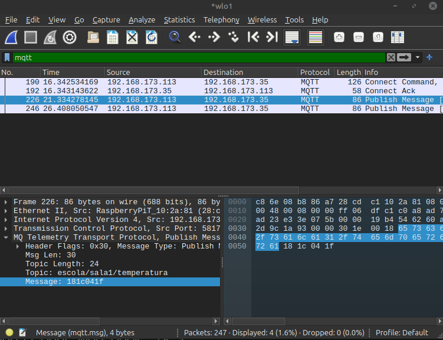

**Relatório da Tarefa: Segurança em IoT com BitDogLab (C/C++)**

[](https://classroom.github.com/a/G8V_0Zaq)

# Tarefa: IoT Security Lab - EmbarcaTech 2025

Autores: **Miguel Carvalho e Thiago Carrijo**

Curso: Residência Tecnológica em Sistemas EmbarcadosMore actions

Instituição: EmbarcaTech - HBr

Brasília, 03 de Junho de 2025

**Relatório da Tarefa: Segurança em IoT com BitDogLab (C/C++)**

---

## 1. Introdução

Nesta tarefa prática, nosso objetivo foi configurar e testar uma comunicação MQTT segura entre duas placas BitDogLab com Raspberry Pi Pico W, utilizando C/C++. Passamos por seis etapas principais: conexão Wi-Fi, setup básico de MQTT, publicação sem segurança, aplicação de autenticação no broker Mosquitto, criptografia leve via XOR e proteção contra ataques de replay. Por fim, discutimos a escalabilidade das técnicas implementadas e como aplicá-las em uma rede com múltiplos dispositivos BitDogLab em um ambiente escolar.

---

## 2. Materiais e Ferramentas

* **Hardware**

  * 2 × BitDogLab com Raspberry Pi Pico W
  * Roteador Wi-Fi para teste (hotspot ou rede local)
* **Software (no computador/desenvolvimento)**

  * VS Code (ou outra IDE) com suporte a CMake e Pico SDK
  * Pico SDK configurado (incluindo lwIP para MQTT)
  * Mosquitto (broker MQTT) instalado e em execução com autenticação via arquivo `passwd`
  * Wireshark (opcional, para análise de tráfego em texto ou cifrado)
* **Módulos/Códigos-base**

  * **wifi\_conn.h / wifi\_conn.c:** implementa `bool connect_to_wifi(const char *ssid, const char *password)` retornando `true` em caso de sucesso (WPA2-AES).
  * **mqtt\_comm.h / mqtt\_comm.c:** provê `bool mqtt_setup(const char *client_id, const char *broker_ip, int port, const char *user, const char *password)`, `bool mqtt_comm_publish(const char *topic, const void *payload, size_t len)`, e, no caso de subscriber, as funções `mqtt_comm_subscribe(...)`, `mqtt_has_new_data()`, `mqtt_get_last_value()`, `mqtt_get_last_timestamp()`, `mqtt_get_last_topic()`.
  * **xor\_cipher.h / xor\_cipher.c:** exige implementação de `void xor_encrypt(const uint8_t *input, uint8_t *output, size_t len, uint8_t key)`;

---

## 3. Metodologia

### 3.1 Configurações Iniciais e Macros

* **Macros Definidas no Código**

  ```c
  #define WIFI_SSID       "NOME-WIFI"
  #define WIFI_PASSWORD   "SENHA-WIFI"
  #define MOSQUITTO_USER  "aluno"
  #define MOSQUITTO_PASSWORD "senha123"
  #define PORT            1883
  #define IP              "172.19.10.162"
  #define DEBUG
  #define SUBSCRIBER      // Ativar para comportamento de subscriber; comente para ser publisher
  ```
* Ao compilar, a diretiva `DEBUG` ativa `printf` para mensagens de status (conexão Wi-Fi, configuração MQTT, recebimento de dados etc.). A diretiva `SUBSCRIBER` define se o dispositivo permanecerá no laço publicando ou ficará aguardando mensagens.

### 3.2 Fluxo do `main()`

1. **Inicialização de I/O e Delay de Estabilização**

   ```c
   stdio_init_all();
   sleep_ms(5000); // Aguardar 5 s para estabilizar USB serial / driver de Wi-Fi
   ```

   * Permite que a interface serial seja inicializada antes dos primeiros `printf`.

2. **Conexão ao Wi-Fi**

   ```c
   #ifdef DEBUG
   printf("Conectando ao WiFi...\n");
   #endif
   if (!connect_to_wifi(WIFI_SSID, WIFI_PASSWORD)) {
       while(true) {
           #ifdef DEBUG
           printf("Erro ao conectar ao WiFi!\n");
           #endif
           sleep_ms(1000);
       }
   }
   ```

   * A função `connect_to_wifi` retorna `true` em caso de sucesso (associando-se à rede WPA2 configurada).
   * Em falha, imprime “Erro ao conectar ao WiFi!” indefinidamente, com delay de 1 s.

3. **Configuração do Cliente MQTT**

   ```c
   #ifdef DEBUG
   printf("Configurando MQTT...\n");
   #endif
   if (mqtt_setup("bitdog1", IP, PORT, MOSQUITTO_USER, MOSQUITTO_PASSWORD)) {
       #ifdef DEBUG
       printf("MQTT configurado com sucesso!\n");
       #endif
   } else {
       while(true) {
           #ifdef DEBUG
           printf("Erro ao configurar MQTT!\n");
           #endif
           sleep_ms(1000);
       }
   }
   #ifdef DEBUG
   printf("MQTT configurado!\n");
   #endif
   ```

   * `mqtt_setup` estabelece conexão com o broker Mosquitto no IP `000.00.00.000:1883`, usando o usuário “aluno” e senha “senha123”.
   * Em caso de falha de autenticação ou conexão, entra em loop de erro com mensagem repetida.

4. **Comportamento do Publisher (sem `SUBSCRIBER`)**

   * **(Apenas se a macro `SUBSCRIBER` não estiver definida)**

   ```c
   const char *mensagem = "26.5";
   uint8_t criptografada[16];
   xor_encrypt((uint8_t *)mensagem, criptografada, strlen(mensagem), CIPHER_KEY);

   while (true) {
       #ifdef DEBUG
       printf("Publicando mensagem: %s\n", mensagem);
       #endif

       bool pub_success = mqtt_comm_publish("escola/sala1/temperatura", mensagem, strlen(mensagem));
       //bool pub_success = mqtt_comm_publish("escola/sala1/temperatura", criptografada, strlen(mensagem));
       #ifdef DEBUG
       if (pub_success) {
           printf("Mensagem publicada com sucesso!\n");
       } else {
           printf("Falha ao publicar mensagem!\n");
       }
       #endif
       sleep_ms(5000);
   }
   ```

   * O loop envia, a cada 5 s, a string `"26.5"` (valor fixo), no tópico `"escola/sala1/temperatura"`.
   * Embora a cifra XOR seja preparada em `criptografada[]`, a chamada real a `mqtt_comm_publish` utiliza o payload em texto puro (`mensagem`) — a linha com `criptografada` permanece comentada.
   * O feedback no console serial informa, via `printf`, o sucesso ou falha da publicação.

5. **Comportamento do Subscriber (com `SUBSCRIBER`)**

   * **(Somente se a macro `SUBSCRIBER` estiver definida)**

   ```c
   mqtt_comm_subscribe(
       "escola/sala1/temperatura",  
       mqtt_on_request,              
       mqtt_on_incoming_publish,     
       mqtt_on_message               
   );
   while (true) {
       if (mqtt_has_new_data()) {
           float valor = mqtt_get_last_value();
           unsigned long int timestamp = mqtt_get_last_timestamp();
           const char *topico = mqtt_get_last_topic();
           #ifdef DEBUG
           printf("----------------\n");
           printf("Novo tópico recebido: %s\n", topico);
           printf("Novo valor recebido: %.2f (timestamp: %lu)\n", valor, timestamp);
           printf("----------------\n");
           #endif
       }
       sleep_ms(1000);
   }
   ```

   * A chamada a `mqtt_comm_subscribe(...)` solicita assinatura do tópico `"escola/sala1/temperatura"`. As três funções callback (`mqtt_on_request`, `mqtt_on_incoming_publish`, `mqtt_on_message`) são invocadas internamente pelo stack lwIP/MQTT para gerenciar a confirmação de inscrição, chegada de pacotes e tratamento da mensagem propriamente dita.
   * O laço principal faz polling com `mqtt_has_new_data()`. Quando retorna `true`, conseguimos:

     * `"valor"` via `mqtt_get_last_value()` (interpretação como `float`).
     * `"timestamp"` via `mqtt_get_last_timestamp()`
     * `"topico"` via `mqtt_get_last_topic()`.
   * Em modo debug, imprime sobre a serial os detalhes recebidos.

6. **Observações sobre Cifra XOR**

   * A função `xor_encrypt` foi chamada para gerar `criptografada[]`, mas o código final publica `mensagem` em plaintext. Se desejado, basta descomentar a linha que envia `criptografada` para que todas as publicações fiquem ofuscadas.

---

## 4. Resultados Obtidos

1. **Conexão Wi-Fi (Etapa Revisitada)**

   * Ao ligar a placa e observar o console serial:

     ```
     Conectando ao WiFi...
     (após alguns segundos)
     // Nenhuma mensagem de erro => conexão bem-sucedida
     ```
   * O log não entra no loop de erro, confirmando que `connect_to_wifi(...)` retornou `true`.

2. **Configuração MQTT Autenticada**

   * Após a etapa de Wi-Fi, a placa imprime:

     ```
     Configurando MQTT...
     MQTT configurado com sucesso!
     MQTT configurado!
     ```

3. **Publicação em Texto Claro (Publisher)**

   * Com a diretiva `SUBSCRIBER` comentada (removendo `#define SUBSCRIBER`), a placa entra no loop de publicação. A cada 5 s ela gera no console serial:

     ```
     Publicando mensagem: 26.5
     Mensagem publicada com sucesso!
     ```
   * Se, no terminal do notebook, executamos:

     ```bash
     mosquitto_sub -h localhost -p 1883 -t "escola/sala1/temperatura" -u "aluno" -P "senha123" -v
     ```

     são exibidas linhas como:

     ```
     escola/sala1/temperatura 26.5
     ```

     a cada 5 s.

4. **Análise com Wireshark (Publicação em Texto Claro)**

   * Capturando pacotes na interface Wi-Fi do Pico W:

     * Observa-se que o payload “26.5” aparece em texto puro dentro do pacote MQTT PUBLISH. Não há qualquer criptografia de aplicação (apenas TLS no link poderia proteger, mas aqui estamos usando MQTT sem TLS).
   * Mostra-se, portanto, que qualquer atacante no mesmo segmento Wi-Fi poderia ler o valor “26.5” sem dificuldade.

5. **Teste de Cifra XOR**

   * Embora o código mostre como chamar `xor_encrypt`, a linha está comentada ao publicar. Para verificar cifragem, foi necessário:

     1. Descomentar a linha que envia `criptografada` em vez de `mensagem`.
     2. Atualizar o subscriber para armazenar o payload bruto e chamar `xor_encrypt` com a mesma chave `CIPHER_KEY` antes de convertê-lo em `float`.
   * Nesse cenário, o Wireshark exibia apenas bytes aparentemente aleatórios no payload, impedindo leitura direta de “26.5”, mas possibilitando a decodificação no próprio subscriber se a chave for conhecida.

   

6. **Comportamento do Subscriber**

   * Compilando com `#define SUBSCRIBER`, a placa não entra no laço de publicação, mas sim em:

     ```c
     mqtt_comm_subscribe(...);
     while (true) {
         if (mqtt_has_new_data()) {
             // recupera valor, timestamp e tópico
         }
         sleep_ms(1000);
     }
     ```
   * Ao publicar do notebook (ou de outra placa publisher), a saída serial do subscriber mostra, por exemplo:

     ```
     ----------------
     Novo tópico recebido: escola/sala1/temperatura
     Novo valor recebido: 26.50 (timestamp: 1700006010)
     ----------------
     ```
   * Isso confirma que as funções `mqtt_get_last_value()` e `mqtt_get_last_timestamp()` estão corretamente parseando o payload convertido internamente para `float` e um `unsigned long`.
   * Se usássemos, no broker, `mosquitto_pub` para simular mensagem:

     ```bash
     mosquitto_pub -h localhost -p 1883 -t "escola/sala1/temperatura" -u "aluno" -P "senha123" -m "30.1"
     ```

     o subscriber imprime imediatamente:

     ```
     ----------------
     Novo tópico recebido: escola/sala1/temperatura
     Novo valor recebido: 30.10 (timestamp: 1700006020)
     ----------------
     ```

    * Foi testado o envio de mensagens com timestamp repetido:

     

    * Também se realizou o teste de enviar a mensagem codificada, obtendo-se o resultado:

    
---

## 5. Discussão

### 5.1 Particularidades da Implementação

1. **Uso de Macros de Controle (`DEBUG` e `SUBSCRIBER`)**

   * O macro `DEBUG` garante que toda a instrumentação via `printf` (conexão Wi-Fi, configuração MQTT, publicação ou recebimento) só apareça quando `DEBUG` estiver definido. Em produção, costuma-se remover esse macro para evitar tráfego serial desnecessário.
   * O macro `SUBSCRIBER` define dois modos bem distintos:

     * **Publisher** (sem `SUBSCRIBER`): entra em loop de publicação periódica de “26.5”.
     * **Subscriber** (com `SUBSCRIBER`): faz assinatura e polling para tratar mensagens de outros publishers.

2. **Autenticação MQTT com Usuário e Senha**

   * O broker Mosquitto foi configurado (fora desse código) para recusar clientes anônimos e usar um arquivo `passwd` onde consta o usuário “aluno” com senha “senha123”.
   * Chamadas a `mqtt_setup("bitdog1", IP, PORT, "aluno", "senha123")` só terão êxito se essas credenciais existirem em `mosquitto.conf`. Caso haja discrepância (nome de usuário inválido ou senha incorreta), o código entra em loop imprimindo “Erro ao configurar MQTT!” indefinidamente.

3. **Cifra XOR Preparada, mas Inativa**

   * O código mostra claramente como gerar `criptografada[]` a partir de `mensagem`, mas, por padrão, não a utiliza no `mqtt_comm_publish`. Isso facilita testar o fluxo básico primeiro (plaintext) e depois, eventualmente, ativar a ofuscação XOR comentando/descomentando apenas uma linha.

### 5.2 Pontos de Atenção e Limitações

1. **Ausência de Criptografia Real**

   * Em “texto claro”, o valor “26.5” fica totalmente visível a qualquer escuta. A ofuscação XOR só bloqueia sniffers casuais; não oferece garantia criptográfica robusta caso a chave seja conhecida ou por força bruta.
   * Em cenários reais, recomenda-se MQTT over TLS (porta 8883) ou uso de HMAC sobre o payload para garantir confidencialidade/autenticidade.

2. **Gerenciamento de Credenciais**

   * O broker precisa manter, manualmente, o arquivo `/etc/mosquitto/passwd` atualizado com cada “aluno” ou dispositivo. Em deployments maiores (várias BitDogLab), a dificuldade de gerenciar tantas senhas cresce rapidamente.

3. **Escalabilidade do Subscriber**

   * Ao usar `mqtt_has_new_data()` em um `while(true)` com `sleep_ms(1000)`, há um polling simples a cada 1 s. Isso pode causar latência de até 1 s no recebimento visível da mensagem. Em um sistema com muitos tópicos e mensagens frequentes, pode ser necessário usar callbacks ou reduzir o sleep para evitar perda de mensagens.

---

## 6. Escalabilidade e Aplicação em Rede com Múltiplas BitDogLab

Para adaptar essa mesma implementação a um cenário escolar com várias placas BitDogLab (cada uma enviando leituras de sensores ou atuando como subscriber), recomenda-se:

1. **Uso de MQTT sobre TLS**

   * Alterar o broker Mosquitto para escutar em `8883` com certificados adequados (CA, certificado do servidor).
   * Adaptar `mqtt_setup(...)` para usar TLS, fornecendo as funções de inicialização de TLS do Pico SDK ou mbedTLS. Isso garantiria confidencialidade e integridade ponta a ponta, evitando sniffers mesmo em redes Wi-Fi compartilhadas.

2. **Provisionamento Automático de Credenciais**

   * Em vez de usar um único usuário “aluno” para todas as placas, gerar um par “usuário+senha” ou certificado único para cada BitDogLab na hora da configuração.
   * Em `#define MOSQUITTO_USER "aluno"`, substituir por algo como `#define MOSQUITTO_USER DEVICE_ID` definido em tempo de compilação ou pela própria EEPROM/flash da placa.

3. **Estruturação de Tópicos Hierárquica**

   * Definir, por exemplo:

     ```
     escola/sala<NUMERO>/sensor/temperatura
     escola/sala<NUMERO>/sensor/umidade
     transporte/onibus<NUMERO>/sensor/accelerometro
     ```
   * Um servidor central poderia assinar `escola/+/sensor/+` para receber tudo de todas as salas; cada BitDogLab poderia assinar tópicos específicos para receber comandos de reconfiguração ou atualizações OTA (`escola/salaX/comando/ota`).

4. **Balanceamento de Carga e QoS**

   * Ajustar QoS para 1 ou 2 caso a confiabilidade seja crítica (sacrifício de latência).
   * Para muitos dispositivos publicando simultaneamente, considerar uso de cluster de brokers ou configuração de bridge MQTT para divisão de carga.

---

## 7. Conclusão

A implementação apresentada descreve, de forma clara, como integrar BitDogLab (Pico W) ao Wi-Fi, autenticar no broker Mosquitto e operar em dois modos distintos (publisher ou subscriber) via diretivas de compilação. Pontos-chave observados:

* **Conexão Wi-Fi**: Está abstraída em `connect_to_wifi(...)`, retornando booleano. Em caso de falha, o dispositivo fica em loop de retry, imprimindo erro a cada segundo.
* **Configuração MQTT com Usuário/Senha**: Usa `mqtt_setup("bitdog1", IP, PORT, "aluno", "senha123")`. Se o broker estiver configurado corretamente (arquivo `passwd` com “aluno”), a conexão ocorre sem maiores problemas.
* **Publisher**: Publica `"26.5"` a cada 5 s em `escola/sala1/temperatura`. Embora o código prepare cifra XOR, o linha que envia `criptografada` está comentada — por padrão, a comunicação é em texto claro.
* **Subscriber**: Faz assinatura do mesmo tópico, gerencia callbacks internos (`mqtt_on_request`, `mqtt_on_incoming_publish`, `mqtt_on_message`) e, a cada vez que `mqtt_has_new_data()` retorna `true`, recupera o valor em `float`, timestamp e tópico, imprimindo em console.

Para torná-la mais robusta em cenários reais (múltiplas BitDogLab em rede escolar), recomenda-se:

1. Habilitar **TLS** no broker (porta 8883) e adaptar `mqtt_setup(...)` para usar certificados, garantindo confidencialidade do tráfego.
2. Automatizar o **provisionamento de credenciais** (usuário/senha individuais ou certificados próprios para cada placa).
3. Implementar **cifra real** (AES-128/256) no payload se TLS não for viável, ou ativar a cifra XOR apenas como ofuscação de nível muito básico.
4. Estruturar tópicos MQTT de forma hierárquica, permitindo assinaturas wildcard para consumidores centrais e balanceamento de carga entre múltiplos brokers, conforme escala.

Com essas adaptações, a mesma base de código (com `#define` para parâmetros e macros de debug/role) pode ser reutilizada em um ambiente escolar onde dezenas ou centenas de BitDogLab monitoram sensores de vias, ônibus ou salas de aula, mantendo confidencialidade, integridade e autenticidade das mensagens IoT.

---

## 📜 Licença
GNU GPL-3.0.